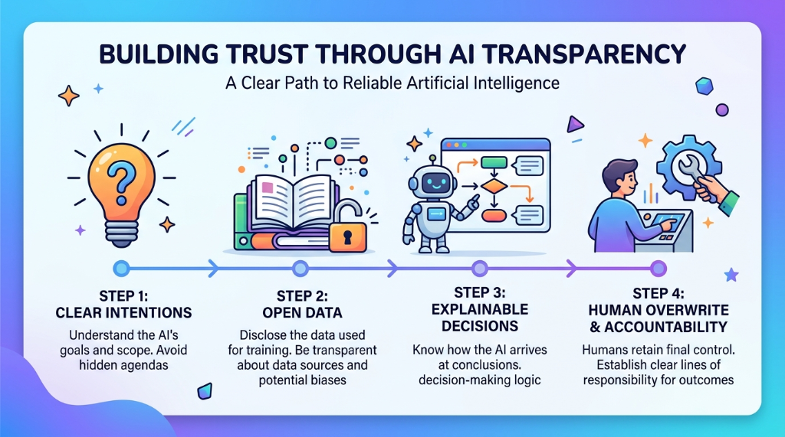
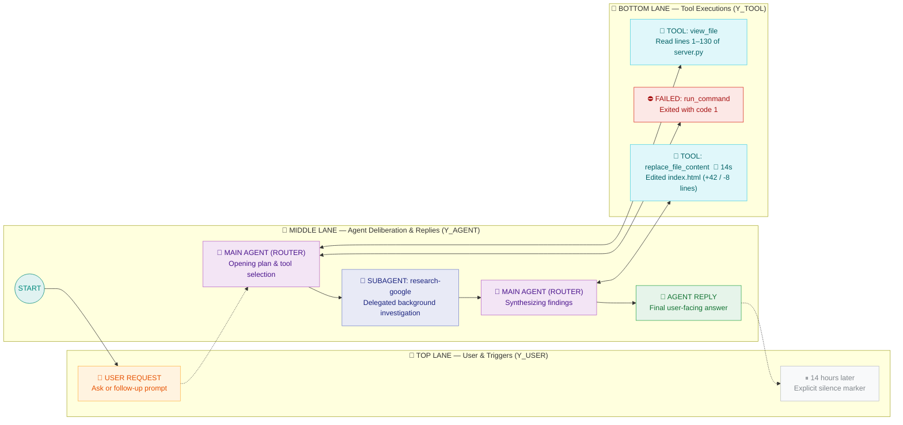
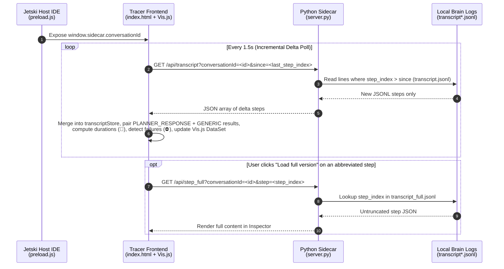

# Jetski Agent Tracer Plugin

[](#)
[-3776AB?style=flat-square&logo=python&logoColor=white)](#%EF%B8%8F-how-it-works)
[](#-3-lane-swimlane-architecture)
[](#2-incremental-tail-polling-serverpy)
[](#-visual-node--status-legend)



A dynamic, LangGraph-style trajectory visualizer for Jetski. This UI plugin renders an agent's real-time workflow as an interactive timeline across three distinct architectural swimlanes—translating raw JSONL logs into plain English so both engineers and non-technical stakeholders can see **what was asked**, **how the agent planned**, **which tools ran**, **where bottlenecks or errors occurred**, and **what was answered**.

---

## 🗺️ 3-Lane Swimlane Architecture

Every turn in a conversation is grouped into a translucent request band across three locked horizontal lanes (`Y_USER`, `Y_AGENT`, `Y_TOOL`):



---

## 🎨 Visual Node & Status Legend

| Node / Badge | Swimlane | Visual Style | What Triggers It |
| :--- | :--- | :--- | :--- |
| **`👤 USER REQUEST`** | Top (`Y_USER`) | 🟧 Warm Orange (`#FFF3E0` / `#FFB74D`) | Every `USER_INPUT` step, stripped of `<ADDITIONAL_METADATA>` and `<CONTEXT_SUMMARY>` XML wrappers. |
| **`⏸ N hours later`** | Top (`Y_USER`) | ⬜ Dashed Grey (`#BDC1C6`) | Inserted automatically before a user request when `≥ 6 hours` elapsed since the previous step. |
| **`🧠 MAIN AGENT (ROUTER)`** | Middle (`Y_AGENT`) | 🟪 Purple (`#F3E5F5` / `#BA68C8`) | `PLANNER_RESPONSE` steps where the agent deliberates (`thinking`) or dispatches `tool_calls`. |
| **`💬 AGENT REPLY`** | Middle (`Y_AGENT`) | 🟩 Emerald (`#E6F4EA` / `#34A853`) | Final `PLANNER_RESPONSE` steps that deliver a user-facing `content` answer with no further tool calls. |
| **`🤖 SUBAGENT: <Type>`** | Middle (`Y_AGENT`) | 🟦 Indigo (`#E8EAF6` / `#7986CB`) | `invoke_subagent` calls, promoted to the middle lane so delegated workflows stay on the agent axis. |
| **`🔧 TOOL: <name>`** | Bottom (`Y_TOOL`) | 🩵 Cyan (`#E0F7FA` / `#4DD0E1`) | Completed tool executions paired with their `GENERIC` output step. |
| **`⏳ RUNNING: <name>`** | Bottom (`Y_TOOL`) | 🟨 Amber Dashed (`#FEF7E0` / `#F9AB00`) | In-flight tool calls waiting for their `GENERIC` result step to arrive. |
| **`⛔ FAILED: <name>`** | Bottom (`Y_TOOL`) | 🟥 Crimson (`#FCE8E6` / `#D93025`) | Tool calls that reported a non-zero exit code, permission denial, or edit failure (`isFailure()`), plus `ERROR_MESSAGE` steps. |
| **`🐢 Ns`** | Bottom (`Y_TOOL`) | 🐢 Slow Badge on Node Title | Appended automatically whenever a tool call's wall-clock duration (`Completed At - Created At`) is `≥ 10s`. |
| **`🗜 CONTEXT CHECKPOINT`** | Middle (`Y_AGENT`) | 🩶 Slate (`#E8EAED` / `#9AA0A6`) | `CHECKPOINT` steps where earlier conversation history was compacted by the runtime. |

---

## ✨ Features

### Reading the Trace
- **Complete coverage:** Renders every step type in the transcript — user prompts (`👤 USER REQUEST`), agent reasoning (`🧠 MAIN AGENT (ROUTER)`), final user-facing answers (`💬 AGENT REPLY`), tool calls, subagent delegations, errors, system notices, and context checkpoints. Nothing is silently dropped.
- **Plain-English inspector:** Click any node for a human-readable summary of what happened. User prompts are stripped of internal XML envelopes (`<ADDITIONAL_METADATA>`, `<CONTEXT_SUMMARY>`) with an attachment badge (`📎 Attached N image(s)`), and tool parameters render as a labelled list with raw JSON tucked behind an expandable toggle.
- **Result summaries:** Every tool result opens with a one-line answer to *"what came back?"* plus stat chips (lines read, matching lines/files, user answers, exit status). The raw output stays one click away instead of filling the panel.
- **Timing & bottleneck browser:** Each call shows how long it took, read from the result's own timestamps. Anything over `10s` gets a `🐢` badge on the graph, and clicking **Slow (>10s)** in the Session Overview (or pressing `s`) opens a ranked **🐢 Slowest Tool Calls** list so you can jump straight to the slowest steps.
- **Browsable failures:** Failed calls turn red, in-flight calls show amber and dashed, and clicking **⚠ Issues** (or the **Failed** tile in the Overview) opens a **⛔ Failures** panel listing every error with its request number and cause. Failure detection reads each tool's actual status headers (non-zero exit codes, permission denials, no-op edits) rather than naive keyword matching.
- **Truncation honesty:** Content abbreviated in the compact log is flagged, with a one-click **Load full version** that pulls on demand from `transcript_full.jsonl`.

### Navigating
- **Goal bar:** A sticky strip under the toolbar that always names the request you're looking at — *"Request 12 of 63"* plus what the agent set out to do — with `‹` `›` steppers and a dropdown to jump to any request.
- **Decluttered timeline scrubber:** A checkpoint pin per user request that automatically slims down on 60+ request traces so pins never fuse together, paired with upper-rim red failure ticks and a top-framed blue viewport window that stays visible over dense clusters.
- **Long gaps marked:** When a session resumes hours or days later, the graph inserts an explicit `⏸ N hours/days later` marker instead of running two different days together.
- **Search with match browser:** Filter by tool name, prompt, or thought text; non-matches dim. Step through hits with `‹` `›`, see your position as `7 / 42`, and click the counter to open `🔎 MATCHES` with surrounding context snippets.
- **Real-Time Auto-Follow:** Pans to track the newest nodes as the agent works, and backs off automatically when you scroll into history.
- **Jump to Start / End**, zoom controls with Y-axis locking, and **adaptive swimlanes** that dynamically fit the panel height so the top lane is never hidden under the sticky Goal Bar.

### Views & Sharing
- **Interactive session overview:** With nothing selected, the side panel reports the whole run — requests, tool calls, clickable **Failed** and **Slow (>10s)** drill-down tiles, total working time, elapsed span, and top tools used.
- **Copy request:** Exports the current request to the clipboard as markdown — what was asked, the agent's plan, every tool call with its duration and outcome, and the agent's final **Answer** — ready to paste into a doc or review.
- **Simple View:** Hides empty router nodes and system/context noise for a clean narrative — ideal for demos. Toggle off to inspect every model round-trip.
- **Macro Summaries:** Contextual grouping boxes summarizing each request turn.
- **Dark & Light Mode toggle (`🌙 Dark` / `☀️ Light` or `d`):** Switch the entire graph canvas, node palette, swimlanes, scrubber, goal bar, and inspector between Dark Mode and Light Mode with one click; preferences persist across reloads in `localStorage`.

---

## ⌨️ Keyboard Shortcuts

Press `?` (or click `⌨` in the top toolbar) at any time to open the in-app shortcut legend. Shortcuts are ignored while typing in an input field.

| Key | Action |
| :--- | :--- |
| <kbd>←</kbd> / <kbd>→</kbd> | Jump to the **previous / next user request** |
| <kbd>/</kbd> | Focus the **Search trace** box |
| <kbd>Enter</kbd> / <kbd>⇧</kbd> + <kbd>Enter</kbd> | Step to the **next / previous search match** |
| <kbd>Esc</kbd> | Clear the active search filter |
| <kbd>n</kbd> | Jump to the **next failed step** on the graph |
| <kbd>s</kbd> | Open the **🐢 Slowest Tool Calls (`≥ 10s`)** panel |
| <kbd>o</kbd> | Return to the **📊 Session Overview** panel |
| <kbd>d</kbd> | Toggle **🌙 Dark / ☀️ Light Mode** |
| <kbd>?</kbd> | Open the **⌨ Keyboard Shortcuts** legend |

---

## ⚙️ How It Works

Every time an agent takes a step in Jetski, the runtime appends a JSON record to the conversation's local log (`~/.gemini/jetski/brain/<conversation-id>/.system_generated/logs/transcript.jsonl`). Raw transcripts can run to thousands of lines of nested JSON and tool outputs — Agent Tracer turns that stream into a readable, three-lane visual story in real time:



### 1. Context Discovery (`preload.js` Bridge)
When you open the Agent Tracer panel or switch chat tabs in Jetski, the injected `/preload.js` bridge exposes `window.sidecar.conversationId`. The frontend detects tab switches automatically (`1s` watcher) and resets the canvas to follow whichever conversation you are looking at.

### 2. Incremental Tail Polling (`server.py`)
Rather than re-reading and shipping megabytes of log data on every tick, the frontend tracks the highest `step_index` it has already seen and polls `GET /api/transcript?conversationId=<id>&since=<last_step_index>` every `1.5s`:
- **`transcript.jsonl` (Compact stream):** Used for fast real-time polling.
- **`transcript_full.jsonl` (On-demand full payload):** When the compact log abbreviates a large field (`truncated_fields`), clicking **Load full version** in the inspector calls `GET /api/step_full?conversationId=<id>&step=<index>` to fetch only that single untruncated record.

### 3. Pairing & Plain-English Translation (`index.html`)
In the raw transcript, a tool call and its output are stored as **separate events**: the model emits a `PLANNER_RESPONSE` containing `tool_calls[]`, and the runtime later appends one or more `GENERIC` steps containing the raw stdout/result text. On each update pass, the frontend:
1. **Pairs calls with results:** Matches each `tool_calls[i]` on a `PLANNER_RESPONSE` with its corresponding `GENERIC` result step so every tool node displays both what was requested and what came back.
2. **Computes real durations:** Parses the `Created At:` and `Completed At:` headers inside tool outputs (falling back to step timestamps) to measure wall-clock execution time and flag calls `≥ 10s` (`🐢`).
3. **Detects tool-specific failures:** Inspects exit codes (`The command exited with code N`), permission errors, and `replace_file_content` error banners (`isFailure()`) instead of naive keyword matching that would false-positive on source code containing the word `"error"`.
4. **Distils plain-English headlines:** Runs `summarizeResult()` and `cleanUserMarkdown()` to strip internal XML wrappers (`<ADDITIONAL_METADATA>`, `<CONTEXT_SUMMARY>`) and summarize raw tool dumps into single-sentence outcomes (`"Read lines 1–130 of server.py"`, `"Found 2 matching lines across 2 files"`).

### 4. Locked-Lane Graph Layout (`Vis.js`)
Nodes are placed onto three fixed horizontal swimlanes whose vertical spacing adapts dynamically to the sidecar window height (`laneOffsetFor(height)`), keeping the top `Y_USER` lane clear of the sticky Goal Bar and the bottom `Y_TOOL` lane clear of the Scrubber at every window size.

---

## 📂 Repository Structure

```text
agent-tracer/
├── plugin.json                 # Jetski plugin manifest (name, version, sidecar mount)
├── README.md                   # Documentation, architecture diagrams, and legends
├── assets/
│   └── hero.png                # Banner graphic
└── sidecars/
    └── tracer/
        ├── sidecar.json        # Sidecar launcher config (runs python3 server.py)
        ├── server.py           # Zero-dependency HTTP server (/api/transcript & /api/step_full)
        └── index.html          # Single-file Vis.js swimlane UI, plain-English translator & inspector
```

---

## 🚀 Installation

Because this is packaged as a native Jetski UI Plugin, installation is seamless:

1. Clone this repository into your Jetski plugins configuration directory:
   ```bash
   mkdir -p ~/.gemini/config/plugins
   git clone https://github.com/elim316/Jetski-Agent-Tracer-Plugin.git ~/.gemini/config/plugins/agent-tracer
   ```
2. Open your Jetski interface and navigate to the **Settings** menu (or Plugins Marketplace).
3. Click on **Plugins** and look for **agent-tracer-plugin**.
4. Click the toggle switch to turn it **ON**. Jetski will automatically integrate it.
5. In any active conversation, click the **+ (Extensions)** button in the chat header and open **Agent Tracer**.
